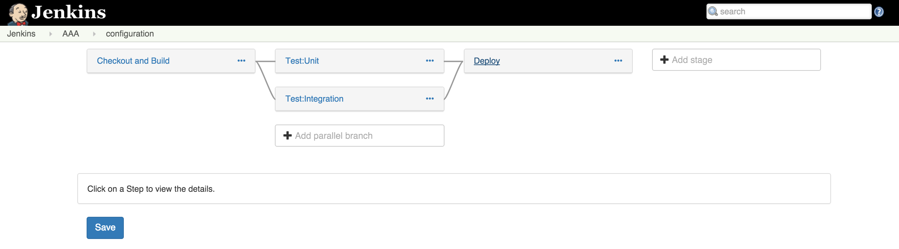
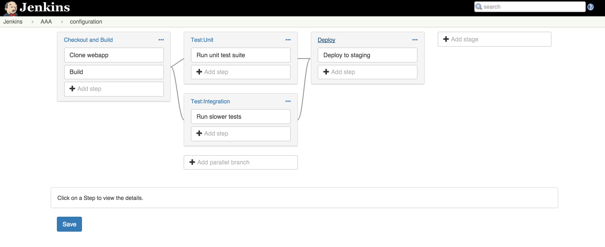
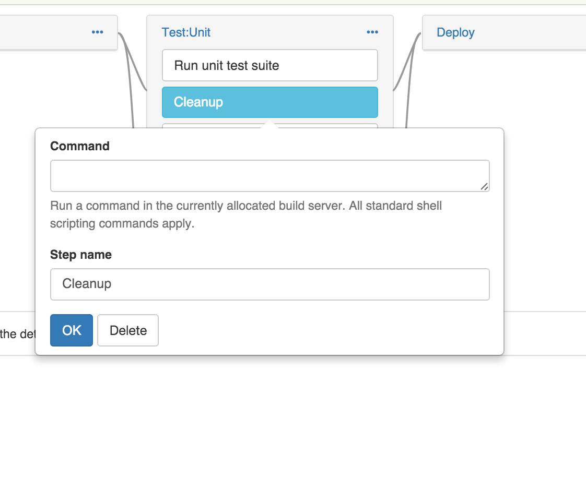
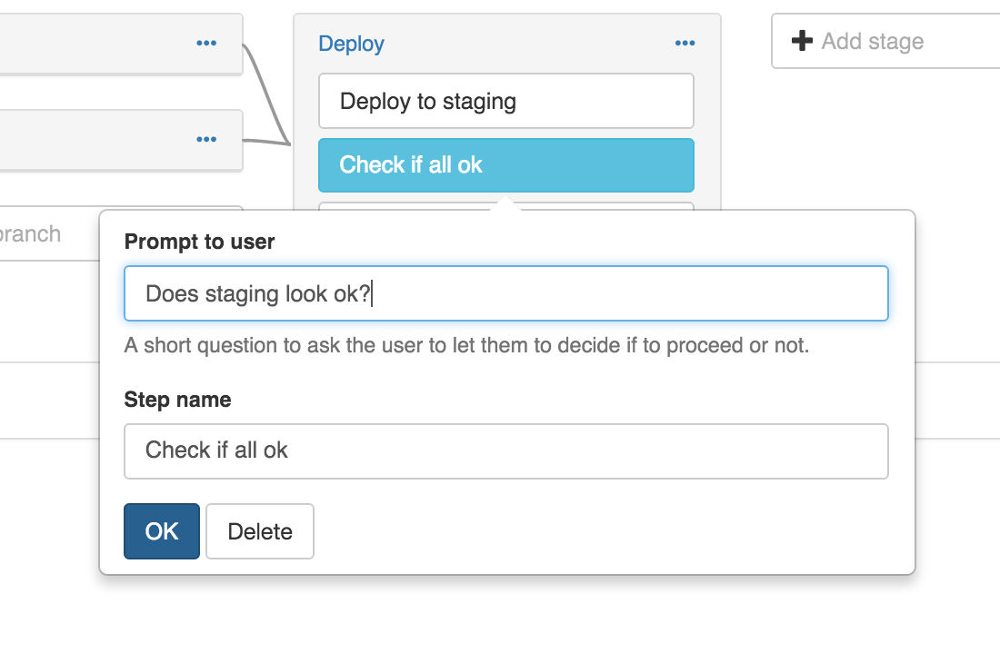
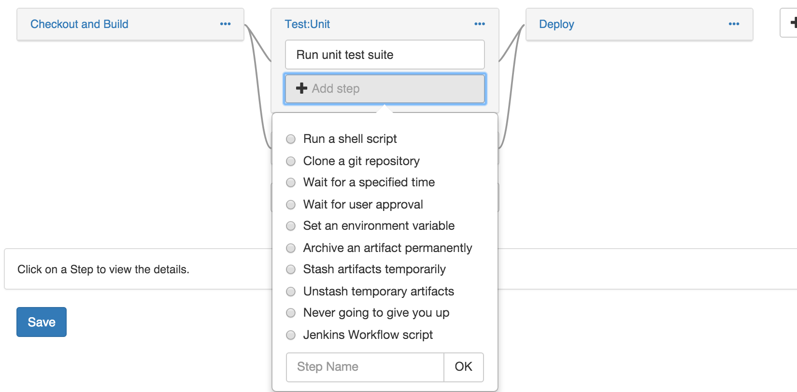
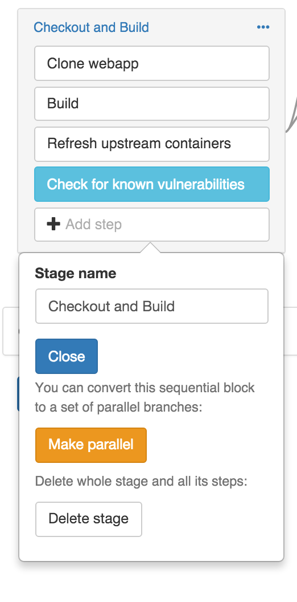
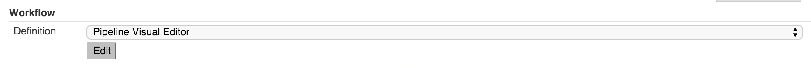

# (Experimental) Visual pipeline editor for Jenkins Workflow. 

_NOTE: this plugin is experimental. It is likely to abruptly change course in design or source code. It may set your hair on fire. Consider yourself warned before using._

# Visual pipelines

The visual pipeline editor supports a stage centric view of Workflow. You expand stages to see the steps within: 

## Editing

Clicking on a step will load the editor specific to that plugin: 

or

You can of course add more steps, from a choice of pre-made types: 

The steps are implemented in [src/main/js/steps](src/main/js/steps) and the intention is to make it extensible (by this and other plugins).

Parallelism is supported as first class. As you can guess by the branching and joining lines shown above. Any set of steps can be split up into parallel branches of execution:
 

You can then add more steps to each parallel branch, or more branches, as needed (and you can convert back too). 

# Try it out

This is a regular Jenkins plugin (although using various javascript tools) so you can run it using the usual 

`mvn hpi:run` or build it using `mvn install` if you want to install it in an existing Jenkins master (note the experimental status, it may blow up in your face!).

Create a new job of the Workflow type, and click "edit" next to the drop down that choses the type of editor you want to use for Workflow: 

Then Click save. It will have saved the workflow and you can execute it (it uses a pre-canned test repo just to show it works end to end).

## Developing the plugin

Run `mvn hpi:run` as it is a normal plugin. 

To work with the JavaScript, you run the following (in another window): 

`npm install`

`npm install -g gulp`

`gulp bundle && gulp rebundle` 

This will set up the js tooling needed and automatically build the changes to the source
js which is stored in main/js to the plugin directory (just reload the browser after that).

# How it works

Right now a json DSL is used (see `json.js`) (and stored in the jenkins config.xml) to keep the state of the UI and pipeline. On change events, a workflow script (via `toWorkflow`) is emitted and stored in the config.xml for actual execution. 

## How to I see the generated workflow script

The plugin regularly logs it to the console (in the browser), but it is also stored in the config(xml) of the Workflow Job. 

# It's a JavaScript plugin

This JavaScript heavy plugin is possible because of https://github.com/tfennelly/jenkins-js-modules and libs made available by: https://github.com/tfennelly/jenkins-js-libs/

This means that namespaced, clean js libraries and css can be made available to any Jenkins plugin that needs it. Ideally, you use the common jQuery, or any library, but if you really need your own, this framework can support it. Using modern js tools like gulp and less make for a smooth development workflow (I like to call it "refresh driven development").
